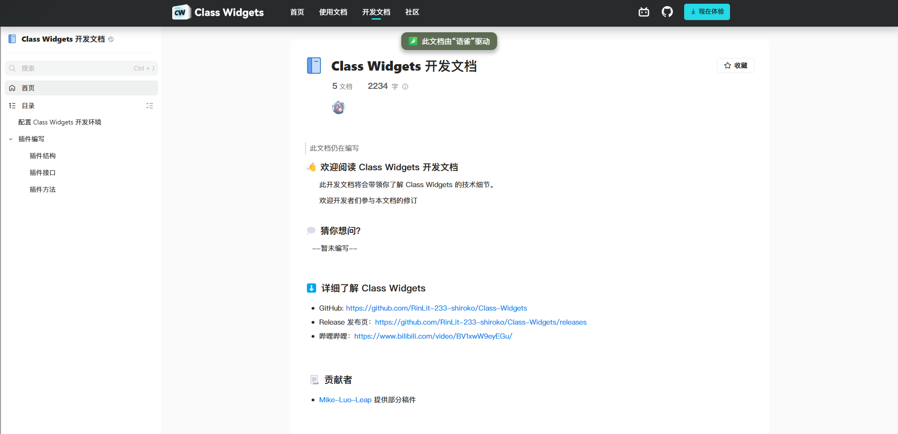

> [!NOTE]
> 欢迎使用本插件模板，该模板可以帮助你快速创建一个新的 Class Widgets 插件项目。
> 此Readme文件是一个示例，可按需进行修改。
> 
> Tip: 若希望下列的徽标正常显示的话可以用替换将"repo-owner/repo-name"替换为你的仓库名。
> 
> 可在[此处](https://www.yuque.com/rinlit/cw-docs-dev)查看教程。

<h1>Class Widgets 插件模板</h1>

## 介绍

本项目是一个 Class Widgets 插件模板，可以帮助你快速创建一个新的 Class Widgets 插件项目。

### 截图

### 特性

- 第一个特性
- 第二个特性
- 第三个特性

## 许可证
本插件采用了 MIT 许可证，详情请查看 [LICENSE](LICENSE) 文件。
Copyright © 2025 Your Name.

## 鸣谢

### 贡献者
Thanks goes to these wonderful people:

### 使用的资源

- [资源1](https://example.com)
- [资源2](https://example.com)
